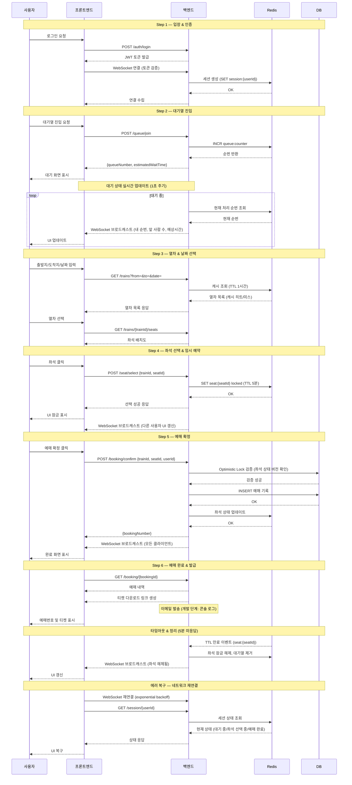

이 spec은 추석 기차표 예매 시스템(DLT 데모)을 즉시 구현 가능한 형태로 정의한다. 대기순번 관리, 좌석 예매, 결제 연동을 핵심 기능으로 하며, AWS 인프라와 Terraform 기반 배포까지 포함한 풀스택 시스템이다. 동시 사용자 1,000명 환경에서의 분산 부하 테스트(DLT) 통과를 최우선 품질 기준으로 삼으며, 좌석 잠금 메커니즘과 WebSocket 실시간 통신이 시스템의 핵심 기술 제약이다. 아래 7개 baseline 원칙을 절대 위반하지 않으며, 위반된 산출물은 실패로 간주합니다.

**작업 지침**:
마인드맵의 모든 노드를 spec 항목으로 빠짐없이 반영하라. 각 노드를 단순 복사하지 말고 구체적인 implementation task로 변환하라. 출력 산출물은 다음 형식을 따른다: a) 핵심 기능별 요구사항 및 수용 기준, b) 기술 스택·동시성 제어·좌석 잠금 전략·API 설계의 구현 명세, c) 대기순번 관리·대기열 상태 전이·좌석 상태를 명시적 상태 머신(enum + transition + 가드 조건)으로 정의, d) 대기순번 관리·좌석 잠금·동시성 제어·좌석 상태 동기화 등 주요 워크플로우를 단계별 처리 흐름으로 구현, e) 프롬프트에 포함된 Mermaid sequenceDiagram이 동작 흐름의 단일 진실원이며 구현 시 이를 기준으로 삼을 것, f) 화면별 UX 흐름·데이터 스키마·AWS 리소스·Terraform 모듈·CI/CD·모니터링 설계를 각각 독립 섹션으로 작성.

**아래 7개 baseline 원칙을 절대 위반하지 않으며, 위반된 산출물은 실패로 간주합니다.**

> **우선순위**: 기능 요구사항과 baseline 원칙이 충돌하면 baseline이 우선. 기능을 축소해서라도 baseline을 지킨다.

---

## 프로젝트 개요
추석 연휴 기차표 예매는 단시간에 수천 명이 동시에 몰리는 극한 트래픽 시나리오의 대표 사례다. 이 시스템은 그 현실을 그대로 재현하는 DLT(분산 부하 테스트) 데모 플랫폼으로, 대기순번 관리·좌석 선택·결제 연동의 전체 예매 흐름을 완결된 형태로 구현한다.

기술적 핵심은 두 가지다. 첫째, 좌석 잠금 메커니즘과 WebSocket 기반 실시간 상태 동기화를 통해 동시 접속자 간 좌석 충돌을 원천 차단한다. 둘째, 대기열 상태 전이를 명시적 상태 머신으로 관리하여 공정한 순번 처리와 예외 상황 복구를 보장한다. 프론트엔드는 모바일부터 데스크톱까지 반응형으로 대응하며, 백엔드는 services 계층 강제와 에러 응답 표준화를 통해 유지보수성을 확보한다.

인프라는 AWS 리소스를 Terraform으로 모듈화하여 dev/staging/prod 환경을 분리 관리하고, CI/CD 파이프라인과 모니터링·알림 체계를 갖춘다. 최종 품질 기준은 DLT 검증으로, 동시 사용자 1,000명 기준 평균 응답시간 500ms 미만, p99 2초 미만, 처리량 100 RPS 이상, 좌석 충돌률 0%를 모두 충족해야 한다.

---

## 📁 디렉토리 구조 (권장)
산출물의 권장 폴더 / 파일 구조다. 마인드맵의 1차 / 2차 가지 의미에서 도출됐으며, 새 파일 작성 / 기존 파일 수정 시 이 구조를 기본 뼈대로 따른다. 프로젝트 특성 (모노레포 / 멀티 패키지 등) 에 맞춰 조정 가능.

```
ticket-booking/
├── frontend/                        # React/Next.js 프론트엔드
│   ├── app/                         # 페이지 라우팅 (Next.js App Router)
│   │   ├── queue/                   # 대기순번 화면
│   │   ├── seats/                   # 좌석 선택 화면
│   │   └── payment/                 # 결제 화면
│   ├── components/                  # 공통 UI 컴포넌트
│   │   ├── SeatMap/                 # 좌석 배치도 렌더링
│   │   └── QueueStatus/             # 대기열 상태 표시
│   ├── hooks/                       # WebSocket·상태 관리 훅
│   └── public/                      # 정적 자산
├── backend/                         # Node.js/FastAPI 백엔드
│   ├── api/                         # 라우터 / 컨트롤러 계층
│   │   ├── queue.ts                 # 대기순번 API
│   │   ├── seats.ts                 # 좌석 예매 API
│   │   └── payment.ts               # 결제 연동 API
│   ├── services/                    # 비즈니스 로직 계층 (강제)
│   │   ├── queueService.ts          # 대기열 상태 머신 처리
│   │   ├── seatLockService.ts       # 좌석 잠금 메커니즘
│   │   └── paymentService.ts        # 결제 처리
│   ├── websocket/                   # WebSocket 서버 (실시간 동기화)
│   ├── db/                          # DB 스키마 / 마이그레이션
│   └── middleware/                  # 에러 표준화 미들웨어
├── shared/
│   └── types/                       # API 타입 단일 진실원
├── infra/
│   ├── terraform/                   # Terraform 모듈화
│   │   ├── modules/
│   │   │   ├── ecs/                 # ECS 클러스터
│   │   │   ├── rds/                 # RDS (좌석·대기열 DB)
│   │   │   ├── elasticache/         # Redis (좌석 잠금·대기열)
│   │   │   └── alb/                 # Application Load Balancer
│   │   └── envs/
│   │       ├── dev/
│   │       ├── staging/
│   │       └── prod/
│   └── monitoring/                  # CloudWatch / 알림 설정
├── .github/
│   └── workflows/                   # CI/CD 파이프라인
├── dlt/                             # 분산 부하 테스트 스크립트
└── .env.example                     # 환경변수 템플릿 (dev/staging/prod)
```

---

## ✅ baseline 준수 체크리스트
산출물 본문 앞에 반드시 아래 체크리스트를 출력할 것. 각 항목마다 본문에서 어떻게 충족했는지 한 줄 근거를 함께 기술하라.

1. ✅ DLT(분산 부하 테스트) 검증 기준: 동시 사용자 1,000명, 평균 응답시간 <500ms, p99 <2s, 좌석 선택 충돌률 0%, 처리량(RPS) ≥100. — [근거]
2. ✅ 프론트엔드는 모바일/태블릿/데스크톱 반응형 대응. — [근거]
3. ✅ 백엔드는 services 계층 강제 + 에러 응답 표준화. — [근거]
4. ✅ API 타입 정의는 shared/types 단일 진실원. — [근거]
5. ✅ 환경 분리(dev/staging/prod) .env 파일로 관리. — [근거]
6. ✅ 한 사용자의 좌석 선택 중에는 다른 사용자가 해당 좌석을 선택할 수 없어야 함(좌석 잠금 메커니즘 필수). — [근거]
7. ✅ 실시간 좌석 상태 업데이트는 WebSocket으로 구현(양방향 통신, 낮은 지연시간 우선). — [근거]

---

## 🔍 구조 패턴 자동 감지 — 단순 bullet 으로 처리 금지
다음 패턴이 마인드맵에서 자동 감지되었습니다. 각 패턴은 *실제 구현 결과물* (state machine / sequence diagram / actor module + 코드) 로 변환되어야 하며, *bullet 으로만 받아들이면 실패* 입니다.

### 감지된 상태 머신 (3개 그룹)
- **대기순번 관리** → states: `대기열 입장 처리`, `순번 상태 관리`, `예매 가능 상태 전환`, `대기열 이탈 처리`, `대기열 상태 조회`
- **대기열 데이터 스키마** → states: `사용자 식별 정보`, `타이밍 메타데이터`, `순서 및 우선순위`, `상태 및 진행도`, `저장소 선택 기준`, `Redis 대기열 구조` (+1)
- **대기열 상태 전이** → states: `WAITING (대기 중)`, `READY (예매 가능)`, `PROCESSING (진행 중)`, `COMPLETED (완료)`, `TIMEOUT (타임아웃)`, `CANCELLED (취소)`
→ 각 그룹을 *명시적 state machine* (enum + transition table + 가드 조건) 으로 구현하세요.
→ 상태 전이를 *Mermaid stateDiagram* 으로 시각화하세요.
→ 잘못된 전이 (예: 완료 → 진행 중) 는 *guard 로 차단* 하는 코드를 작성하세요.

### 감지된 워크플로우 (10개)
- **대기순번 관리** (depth 2, 5 단계)
- **기술 아키텍처** (depth 1, 7 단계)
- **좌석 잠금 전략** (depth 2, 6 단계)
- **동시성 제어** (depth 2, 6 단계)
- **좌석 상태 동기화** (depth 3, 3 단계)
- **API 설계** (depth 2, 3 단계)
- **에러 처리 & 복구** (depth 2, 4 단계)
- **사용자 경험 & 화면** (depth 1, 6 단계)
→ 각 워크플로우를 *단계별 함수 / 이벤트 핸들러* 로 구현하세요.
→ 단계 간 데이터 흐름을 *sequenceDiagram* 으로 시각화하세요.


---

## 🔄 동작 흐름 다이어그램 (1개)

다음 다이어그램은 마인드맵에서 캔버스에 직접 작성된 *설계 흐름의 단일 진실원* 이다. spec / 코드 구현 시 이 흐름을 그대로 따르고, 임의로 단계를 추가 / 생략하지 마라. 다이어그램과 본문 bullet 이 충돌하면 *다이어그램 우선*.

### 예매 흐름 의 시퀀스 / 상호작용 흐름



---

## 1. ⚙️ 핵심 기능
사용자가 직접 상호작용하는 주요 기능 모음.

- 📊 대기순번 관리: 사용자 입장 시 대기열에 추가, 순번 실시간 업데이트, 예매 가능 상태 알림.
  - 🚶 대기열 입장 처리: 사용자 입장 시 대기열에 추가하고 초기 순번을 할당하며 입장 타임스탬프를 기록.
  - 🔢 순번 상태 관리: 현재 순번, 앞 사람 수, 예상 대기 시간 계산 및 실시간 업데이트.
  - 🔔 예매 가능 상태 전환: 순번 도달 시 예매 가능 상태로 전환하고 사용자에게 알림 발송.
  - 🚪 대기열 이탈 처리: 타임아웃, 사용자 취소, 예매 완료 시 대기열에서 제거.
  - 🔍 대기열 상태 조회: 내 순번, 대기 현황, 예상 시간 등 조회 API 및 UI.
- 💺 좌석 예매: 열차 좌석 맵 시각화, 선택 가능/예약됨/선택됨 상태 표시, 중복 예매 방지.
  - 👆 좌석 선택 & 변경: 사용자가 원하는 좌석을 선택하고 필요 시 변경할 수 있는 인터랙션.
  - ✅ 선택 좌석 확정: 선택한 좌석을 최종 확정하고 예매 프로세스로 진행.

## 2. 🏗️ 기술 아키텍처
프론트엔드/백엔드 기술 스택, 동시성 제어, 실시간 통신, 잠금 전략, API 설계.

- 📱 프론트엔드 기술: Next.js + React + TypeScript + CSS. 실시간 좌석 상태 반영(WebSocket/SSE), 좌석 선택 중 UI 잠금, 예약된 좌석 빨간색 표시.
- 🔧 백엔드 기술: Node.js(Express) + TypeScript. 동시성 처리(async/await), 대기열 관리(Redis), 좌석 잠금(Optimistic/Pessimistic Lock), MySQL RDS 연동.
- 🔄 동시성 제어: 여러 사용자의 동시 접근 시 좌석 중복 예매 방지 및 공정한 순서 보장 메커니즘.
  - 📋 대기열 공정성: Redis 기반 FIFO 큐로 입장 순서 관리. 동시 진입 시에도 순번 중복 없이 공정한 배분.
  - 🔢 순번 중복 방지: Redis 원자성(atomic operation)을 활용한 INCR/GETSET으로 중복 없는 순번 발급.
  - 👥 동시 처리 한계 설정: 동시에 좌석 선택 가능한 최대 사용자 수. 프로덕션 환경: 500명 설정. AWS 인프라에서 직접 DLT 검증.
  - 📦 처리 순서 관리: 현재 처리 중인 사용자 ID 목록(Redis SET). 백엔드 타이머(1초 주기)가 WAITING 상태 사용자 중 상위 N명을 READY로 전이.
  - ⏰ 타임아웃 & 만료 처리: TTL 설정으로 좌비 큐 항목 제거, 응답 없는 사용자 자동 탈락.
  - 🔧 큐 상태 복구: Redis 장애/재시작 시 대기열 상태 영속성 보장 및 복구 전략(RDB/AOF).
- 📡 실시간 통신: 좌석 상태 변화를 모든 클라이언트에 즉시 반영. WebSocket 또는 SSE 기반 양방향 통신.
  - 🔌 WebSocket 연결: Express + ws 라이브러리로 양방향 실시간 통신. 좌석 상태 변화 시 모든 연결된 클라이언트에 브로드캐스트.
  - 🔄 좌석 상태 동기화: Redis 캐시에서 좌석 상태 조회 → 변화 감지 → 클라이언트 UI 업데이트(빨간색 표시). 낙은 지연시간 보장.
    - 💾 Redis 캐시 조회: 현재 좌석 상태를 Redis에서 조회하고 메모리에 로드하는 단계. 낙은 지연시간 보장.
    - 🔎 변화 감지 (Diff): 이전 상태와 현재 상태를 비교하여 변경된 좌석만 식별. 불필요한 업데이트 최소화.
    - 📤 클라이언트 푸시 전송: 변경된 좌석 정보를 WebSocket/SSE로 클라이언트에 실시간 전송.
- 🔐 좌석 잠금 전략: 사용자가 좌석 선택 중일 때 다른 사용자의 접근 차단. TTL 임시 예약 + Optimistic Lock 하이브리드 선택.
  - 🔒 Pessimistic Lock (비관적 잠금): DB row lock으로 좌석 선택 시점에 즉시 잠금. 동시 접근 원청 차단, 충돌 가능성 낙음.
  - 🔓 Optimistic Lock (낙관적 잠금): Version 또는 timestamp 기반 충돌 감지. 잠금 없이 진행 후 커밋 시 검증.
  - 📦 분산 잠금 (Redis/Zookeeper): 외부 캐시/조율 서비스로 좌석 상태 관리. 마이크로서비스 환경에서 일관성 보장.
  - ⏱️ TTL 기반 임시 예약: 선택 후 5분 동안 해당 사용자에게 독점권 부여. 시간 초과 시 자동 해제.
  - 📥 큐 기반 순차 처리: 예매 요청을 큐에 적재 후 순차 처리. 동시성 제거, 공정성 보장.
  - ⚖️ 하이브리드 (다단계 전략): TTL 임시 예약(5분) + 최종 커밋 시 Optimistic Lock 검증. 사용성과 안정성 균형. 프로토타입 채택 전략.
- 🔗 API 설계: REST API 엔드포인트 및 WebSocket 이벤트 타입 정의.
  - 📝 REST API 엔드포인트: POST /queue/join, GET /trains, GET /trains/{id}/seats, POST /seat/select, POST /booking/confirm, GET /booking/{id}, GET /session/{userId} 등 주요 엔드포인트 정의.
  - 📡 WebSocket 이벤트 타입: 클라이언트→서버: JOIN_QUEUE, SELECT_SEAT, CONFIRM_BOOKING. 서버→클라이언트: QUEUE_UPDATE, SEAT_STATUS, BOOKING_RESULT, ERROR. 각 이벤트 페이로드는 shared/types에 정의.
  - 📬 대기열 관련 API: POST /queue/join (입장), GET /queue/status/{userId} (상태 조회), DELETE /queue/leave (취소). WebSocket: QUEUE_UPDATE 이벤트로 실시간 브로드캐스트.
- ⚠️ 에러 처리 & 복구: 네트워크 끊김, 타임아웃, DB 연결 실패, 결제 실패 등 상황별 사용자 메시지 및 복구 전략.
  - 🔁 자동 재시도 로직: 지수 백오프(exponential backoff) 기반 재시도, 최대 재시도 횟수 제한, 재시도 로그 기록.
  - 🔧 상태 정합성 복구: 결제 중 네트워크 끊김 후 좌석/결제 상태 동기화, 부분 실패 복구, 트랜잭션 롤백 처리.
  - 🔄 에러 복구 시퀀스: 네트워크 끊김 감지 → 프론트엔드 자동 재연결(exponential backoff) → 백엔드 세션 상태 조회(GET /session/{userId}) → 현재 상태 응답 → 프론트엔드 UI 복구.
  - 🚨 에러 상황별 처리: 네트워크 끊김, 타임아웃, DB 연결 실패, 결제 실패 등 상황별 사용자 메시지 및 복구 전략.

## 3. 🖥️ 사용자 경험 & 화면
예매 단계별 UX 흐름, 상태 표시, 피드백 화면 설계.

- 🚶 예매 전체 흐름: 입장 → 대기 → 좌석 선택 → 예매 완료 단계별 화면. 사용자 전체 여정 흐름.
  - 🔑 Step 1: 입장 & 인증: 사용자 로그인 → JWT 토큰 발급 → WebSocket 연결 시 토큰 검증 → 세션 생성(Redis).
  - 📍 Step 2: 대기열 진입: POST /queue/join 호출 → Redis INCR로 순번 할당 → 응답: {queueNumber, estimatedWaitTime} → WebSocket 구독 시작(대기 상태 업데이트).
  - 🚂 Step 3: 열차 & 날짜 선택: GET /trains?from=&to=&date= → 열차 목록 조회(캐시: Redis 1시간 TTL) → 사용자 선택 → GET /trains/{trainId}/seats → 좌석 배치도 조회.
  - 💺 Step 4: 좌석 선택 & 예약: 사용자 좌석 클릭 → POST /seat/select {trainId, seatId} → 백엔드 Redis SET(TTL 5분) → 응답 성공 → 프론트엔드 UI 잠금 표시 → WebSocket 브로드캐스트(다른 사용자 UI 갱신).
  - ✅ Step 5: 예매 확정: 사용자 '예매 확정' 클릭 → POST /booking/confirm {trainId, seatId, userId} → 백엔드 Optimistic Lock 검증 → DB INSERT → 응답: {bookingNumber} → 프론트엔드 완료 화면.
  - 🎫 Step 6: 예매 완료 & 발급: 예매번호 표시 → 예매 내역 조회(GET /booking/{bookingId}) → 티켓 다운로드 링크 생성 → 이메일 발송(개발 단계: 콘솔 로그만).
- 📊 상태 표시: 현재 대기순번, 남은 시간, 좌석 가용성, 로딩/에러/완료 상태 명시.
  - ⏳ 대기 정보: 현재 대기순번, 예상 대기 시간, 앞의 사용자 수 표시.
  - 📊 자원 가용성: 선택 가능한 좌석 수, 남은 좌석 비율, 실시간 업데이트 여부.
  - 🚨 시스템 상태: 로딩 중 / 에러 / 네트워크 끊김 / 서버 점검 등 시스템 상태 피드백.
  - 🎉 결과 피드백: 예매 성공 / 실패 / 취소 등 최종 결과 및 다음 액션 안내.
  - ⏱️ 시간 제약: 세션 만료 시간, 결제 제한 시간, 좌석 선택 타임아웃 카운트다운.
  - 📍 예매 진행 상태: 현재 예매 프로세스 단계 (검색 중 / 좌석 선택 / 결제 진행 / 완료) 명시.
- 💺 좌석 상태 인식: 열차 좌석 맵 시각화 및 예약 상태(가능/예약됨/선택됨) 실시간 표시.
- 🔍 좌석 필터링 & 추천: 사용자 선호도(창가/복도/앞/뒤)에 따른 좌석 필터링 및 추천 기능.
- 🟥 UI 렌더링 (빨간색): 클라이언트에서 예매 불가 좌석을 빨간색으로 표시하고 사용자에게 시각적 피드백 제공.
- 📊 시퀀스 다이어그램: 사용자-프론트엔드-백엔드-DB/Redis 간 상호작용 시퀀스. 대기열 진입 → 좌석 선택 → 예매 확정 단계별 메시지 흐름.
  - 🚶 대기열 진입 시퀀스: 사용자 입장 → 프론트엔드 POST /queue/join → 백엔드 Redis INCR로 순번 할당 → 응답(순번, 예상 대기시간) → 프론트엔드 WebSocket 연결.
  - 📊 대기 상태 실시간 업데이트: 백엔드 타이머(1초 주기) → 현재 처리 순번 조회 → 모든 대기 중인 클라이언트에 WebSocket 브로드캐스트(내 순번, 앞 사람 수, 예상시간) → 프론트엔드 UI 업데이트.
  - 💺 좌석 선택 시퀀스: 사용자 좌석 클릭 → 프론트엔드 POST /seat/select → 백엔드 Redis SET(TTL 5분) 좌석 잠금 → 응답(성공/실패) → 프론트엔드 UI 잠금 표시 → 모든 클라이언트에 WebSocket 브로드캐스트.
  - ✅ 좌석 선택 확정 시퀀스: 사용자 '예매 확정' 클릭 → 프론트엔드 POST /booking/confirm → 백엔드 Optimistic Lock 검증(좌석 상태 버전 확인) → DB INSERT 예매 기록 → Redis 좌석 상태 업데이트 → 응답(예매번호) → 모든 클라이언트 브로드캐스트.
  - ⏰ 타임아웃 & 정리 시퀀스: 사용자 미응답 5분 → Redis TTL 만료 → 백엔드 자동 정리(좌석 잠금 해제, 대기열 제거) → 모든 클라이언트에 브로드캐스트(좌석 해제됨) → 프론트엔드 UI 갱신.
  - 🔄 에러 복구 시퀀스: 네트워크 끊김 감지 → 프론트엔드 자동 재연결(exponential backoff) → 백엔드 세션 상태 조회(GET /session/{userId}) → 현재 상태 응답(대기 중/좌석 선택 중/예매 완료) → 프론트엔드 UI 복구.

## 4. 🗄️ 데이터 설계
대기열/좌석 데이터 스키마, 상태 전이 규칙, 저장소 전략.

- 🗂️ 대기열 데이터 스키마: Redis + MySQL에서 관리할 대기열 데이터 구조. Redis: 실시간 순번/상태, MySQL: 영속 기록.
  - 👤 사용자 식별 정보: 사용자ID, 이메일, 전화번호 등 대기열 진입자를 고유하게 식별하는 속성.
  - 🕒 타이밍 메타데이터: 입장시간, 대기시간, 예상완료시간 등 시간 기반 정보.
  - 🎖️ 순서 및 우선순위: 순번, 우선순위 레벨(VIP/일반), 대기열 내 상대 위치.
  - 📊 상태 및 진행도: 현재 상태(대기/진행/완료), 진행률, 마지막 상태 변경 시각.
  - 💾 저장소 선택 기준: Redis(고속 조회), 메모리 큐(경량), DB(영속성) 중 데이터 특성별 선택 전략.
  - 💾 Redis 대기열 구조: FIFO 큐: queue:{trainId} = [userId1, userId2, ...]. 사용자 상태: user:{userId}:{trainId} = {queueNumber, timestamp, status}. TTL 5분 자동 만료.
  - 📝 MySQL 대기열 기록: 테이블: queue_history (id, userId, trainId, queueNumber, joinedAt, exitedAt, status, reason). 개발 단계에서 로그 추적용.
- 💺 좌석 데이터: 열차ID, 좌석번호, 상태(가용/임시예약/판매), 예약자ID, 잠금상태, 잠금만료시간. MySQL RDS 저장소 사용.
  - 🔑 좌석 식별 정보: 열차ID, 좌석번호 등 좌석을 유일하게 식별하는 속성. 기본키 구성.
  - 🔄 좌석 상태 관리: 가용/임시예약/판매 상태와 상태 전이 로직. 예약자ID 포함.
  - 🔐 좌석 접근 제어: 동시성 제어를 위한 잠금상태, 잠금만료시간. 분산 트랜잭션 안전성 보장.
- 🔄 대기열 상태 전이: 대기→진행→완료 전이 조건, 타임아웃 처리, 취소/복구 로직. 상태: WAITING → READY → PROCESSING → COMPLETED / CANCELLED / TIMEOUT.
  - ⏳ WAITING (대기 중): 사용자 입장 직후. 조건: 현재 처리 중인 사용자 수 < 동시 처리 한계(500명). 다음: 순번 도달 시 READY로 전이.
  - 🟢 READY (예매 가능): 사용자 순번 도달, 좌석 선택 가능 상태. 조건: 내 순번 = 현재 처리 순번. 다음: 좌석 선택 시작 시 PROCESSING으로 전이.
  - 🟡 PROCESSING (진행 중): 사용자가 좌석 선택 중. 다음: 예매 확정 시 COMPLETED, 타임아웃 시 TIMEOUT, 취소 시 CANCELLED.
  - ✅ COMPLETED (완료): 예매 확정 완료. 조건: POST /booking/confirm 성공. 대기열에서 제거, MySQL 기록 저장.
  - ⏰ TIMEOUT (타임아웃): 5분 이상 응답 없음. 조건: Redis TTL 만료 또는 마지막 활동 시간 > 5분. 대기열 제거, 좌석 잠금 해제.
  - ❌ CANCELLED (취소): 사용자 명시적 취소. 조건: '취소' 버튼 클릭 또는 페이지 이탈. 대기열 제거, 좌석 잠금 해제.
- 📊 공정성 모니터링: 평균 대기 시간, 순번 분포, 공정성 지표(Gini 계수 등) 실시간 추적.
- ⭐ 우선순위 예외 정책: VIP/장애인/임산부 등 정책적 우선순위 큐 분리 또는 가중치 적용 규칙.

## 5. ☁️ 인프라 & 운영
AWS 리소스 구성, Terraform, CI/CD, 모니터링, DLT 검증 기준.

- 🏗️ AWS 리소스 구성: EC2(Node.js 백엔드), RDS(MySQL), ElastiCache(Redis), ALB(로드밸런싱), S3(로그 저장). 개발 단계에서 t3.micro/small 인스턴스 사용.
- 📦 Terraform 모듈화: VPC, 서브넷, 보안그룹, IAM 역할 등을 모듈로 분리. dev/staging/prod 환경 변수 분리 관리.
- 🔄 CI/CD 파이프라인: AWS CodePipeline으로 자동 빌드/테스트/배포. dev 브랜치 → CodeBuild(테스트) → dev 환경 배포, main 브랜치 → CodeBuild → staging 환경 배포. CodeCommit 또는 GitHub 연동.
- 📊 모니터링 & 알림: CloudWatch 메트릭(CPU/메모리/네트워크), 로그 수집, 에러 알림. 개발 단계에서 기본 대시보드 구성.
- 📊 DLT 검증 기준: 동시 사용자 1,000명, 평균 응답시간 <500ms, p99 <2s, 좌석 선택 충돌률 0%, 처리량(RPS) ≥100. 개발 단계에서 단계적 부하 테스트 수행.
