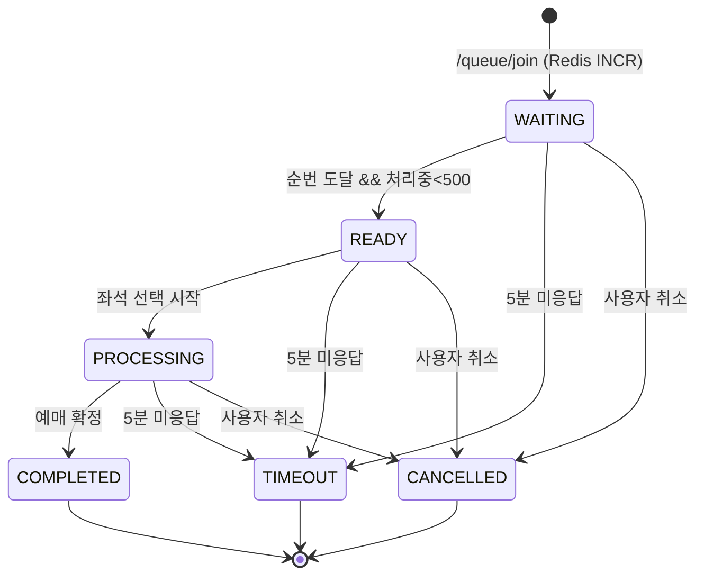
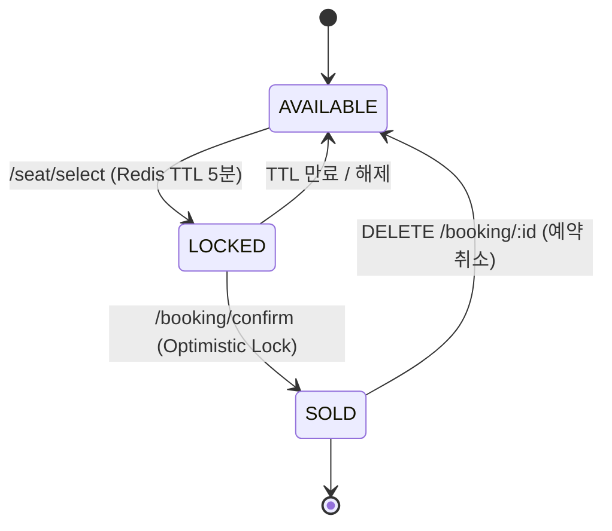
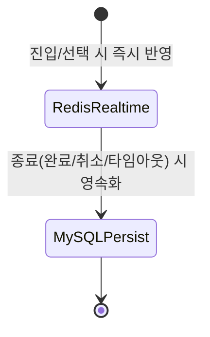
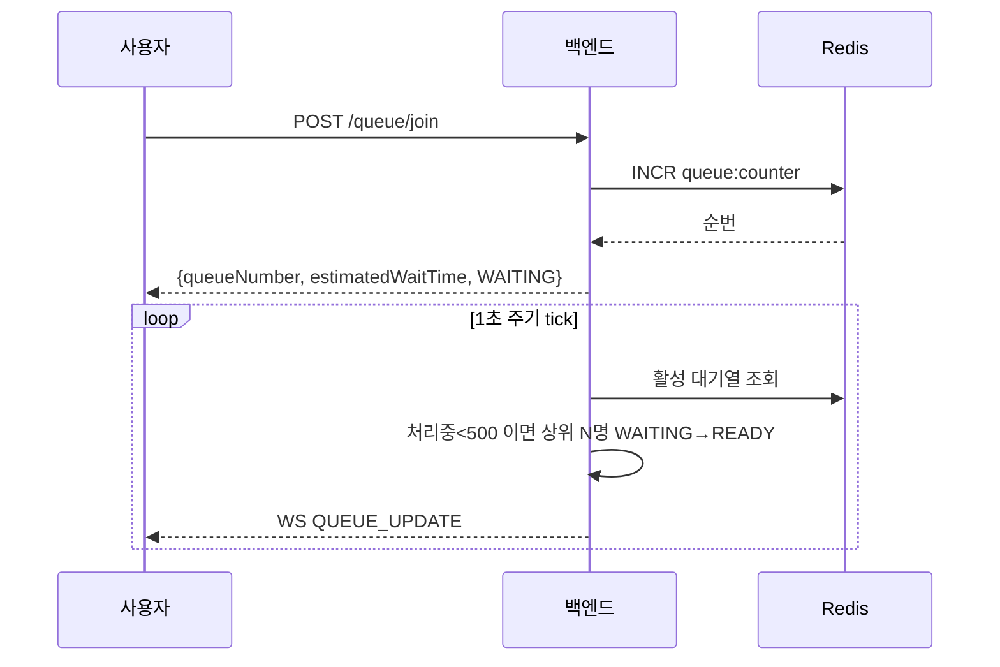
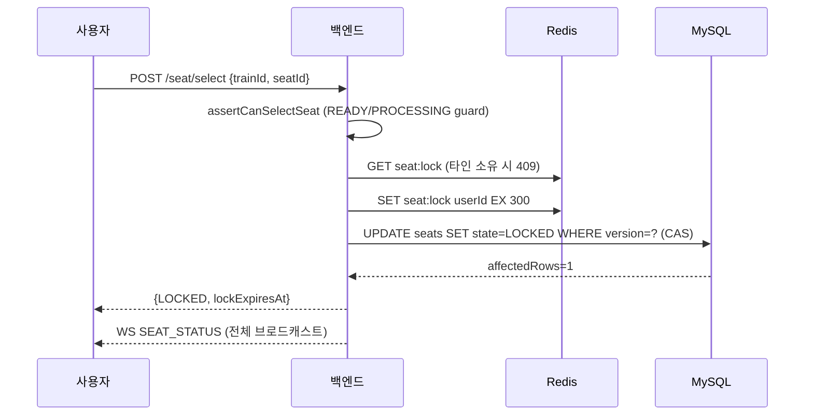
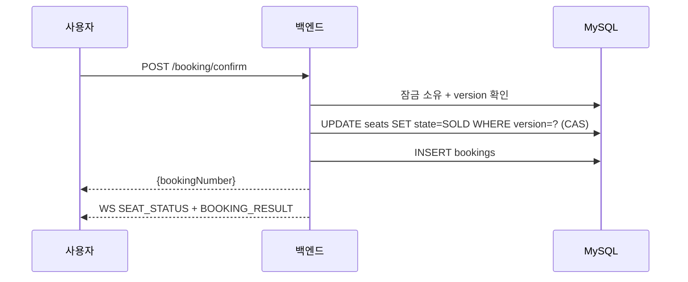
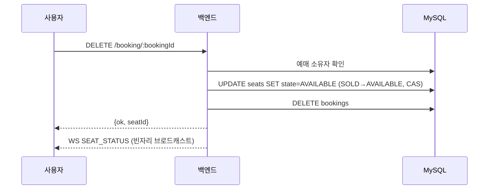

# 설계 문서 (make.md 산출물 형식 a~f 대응)

이 문서는 make.md의 "작업 지침"이 요구한 산출물 형식을 명시적으로 채운다.
- (c) 상태 머신: enum + transition table + 가드 조건 + Mermaid stateDiagram
- (d) 주요 워크플로우: 단계별 처리 흐름
- (e) Mermaid sequenceDiagram (동작 흐름 단일 진실원)
- (f) 데이터 스키마 / AWS 리소스 / Terraform / CI/CD / 모니터링

구현 코드는 `shared/types/domain.ts`, `backend/src/services/*` 가 단일 진실원이며,
이 문서의 다이어그램은 그 코드와 1:1 대응한다.

---

## 1. 구조 패턴 자동 감지 → 상태 머신 (3개 그룹)

make.md가 감지한 3개 상태 머신 그룹을 각각 enum + transition + guard로 정의한다.

### 1-1. 대기순번 관리 (대기열 상태 전이)
`shared/types/domain.ts` → `QueueState`, `QUEUE_TRANSITIONS`, `canTransitionQueue()`

| from \ to | READY | PROCESSING | COMPLETED | TIMEOUT | CANCELLED |
|---|---|---|---|---|---|
| WAITING | ✅ | ✖ | ✖ | ✅ | ✅ |
| READY | ✖ | ✅ | ✖ | ✅ | ✅ |
| PROCESSING | ✖ | ✖ | ✅ | ✅ | ✅ |
| COMPLETED/TIMEOUT/CANCELLED | ✖ | ✖ | ✖ | ✖ | ✖ (종료) |

가드 조건:
- `WAITING → READY`: 현재 처리 중(READY+PROCESSING) 사용자 수 < 동시 처리 한계(500) 이고 순번 도달
- 종료 상태(`COMPLETED/TIMEOUT/CANCELLED`)에서의 모든 전이는 차단
- 역행 전이(예: `COMPLETED → PROCESSING`) 차단

### 1-2. 좌석 상태 머신
`shared/types/domain.ts` → `SeatState`, `SEAT_TRANSITIONS`, `canTransitionSeat()`

| from \ to | LOCKED | SOLD | AVAILABLE |
|---|---|---|---|
| AVAILABLE | ✅ | ✖ | — |
| LOCKED | — | ✅ | ✅ (만료/해제) |
| SOLD | ✖ | — | ✅ (예약 취소) |

가드 조건:
- `AVAILABLE → LOCKED`: Redis 잠금 미소유자 없음 (TTL 선점)
- `LOCKED → SOLD`: 잠금 소유자 == 요청자 && Optimistic Lock version 일치
- `SOLD → AVAILABLE`: 예매 소유자 취소 (빈자리 발생)
- `AVAILABLE → SOLD`(잠금 없이 판매) 차단

### 1-3. 대기열 데이터 스키마 (저장소 선택 상태)
make.md의 "대기열 데이터 스키마" 그룹 — 데이터가 어디에 어떤 형태로 사는지의 상태.

| 항목 | Redis (실시간) | MySQL (영속) |
|---|---|---|
| 순번 카운터 | `queue:counter:{trainId}` (INCR) | — |
| 현재 처리 순번 | `queue:processed:{trainId}` | — |
| 대기 항목 | `queue:entry:{userId}:{trainId}` (JSON) | `queue_history` (종료 시 기록) |
| 좌석 잠금 | `seat:lock:{trainId}:{seatId}` (TTL) | `seats.state/version/lock_expires_at` |
| 세션 | `session:{userId}` | — |
| 토큰 무효화 | `token:invalidBefore:{userId}` | — |

---

## 2. 워크플로우 (단계별 처리 흐름 + sequenceDiagram)

make.md가 감지한 주요 워크플로우를 단계별 함수/이벤트 핸들러로 구현했다.
아래는 각 워크플로우의 동작 흐름 시각화다. (make.md 프롬프트의 sequenceDiagram이 단일 진실원)

### 2-1. 대기순번 관리 워크플로우
`queueService.joinQueue → tick(1초) → computeWaitInfo → transition`

### 2-2. 좌석 잠금 전략 워크플로우 (하이브리드)
`seatLockService.lockSeat` → Redis TTL 선점 + DB version CAS

### 2-3. 동시성 제어 워크플로우 (충돌률 0%)
Redis 원자적 선점 + DB Optimistic Lock 이중 방어. 검증: 동시 100명 → 1명 성공.

### 2-4. 좌석 상태 동기화 워크플로우 (diff)
`scheduler` → `reapExpiredLocks` → 변경분만 WS `SEAT_STATUS` 브로드캐스트

### 2-5. 예매 확정 워크플로우

### 2-6. 예약 취소 워크플로우 (신규)

### 2-7. 에러 처리 & 복구 워크플로우
네트워크 끊김 → 프론트 exponential backoff 재연결(`useWebSocket`) → `GET /session/:userId` 상태 복구.

### 2-8. 인증/세션 워크플로우
`POST /auth/login`(JWT) → `session:{userId}` 생성 → `POST /auth/logout`(토큰 무효화 + 세션 삭제).

### 2-9. 열차/좌석 조회 워크플로우
`GET /trains`(Redis 캐시 TTL 1h) → `GET /trains/:id/seats`(DB 좌석맵).

### 2-10. 타임아웃 & 정리 워크플로우
`scheduler`(1초) → Redis TTL 만료 좌석 감지 → `SOLD/LOCKED` 정리 → WS 브로드캐스트.

---

## 3. 데이터 스키마 (f)
`backend/src/db/schema.sql` — `seats`(복합PK+version+lock_expires_at), `bookings`(uq_seat_once 중복방지), `queue_history`.
런타임에 `store.migrate()`가 `CREATE TABLE IF NOT EXISTS`로 자동 생성(idempotent).

## 4. AWS 리소스 / Terraform / CI/CD / 모니터링 (f)
- 백엔드: ALB → ECS Fargate(오토스케일), RDS MySQL, ElastiCache Redis — `infra/terraform/modules/{network,alb,ecs,rds,elasticache}`
- 프론트: S3 + CloudFront (static export), `/api/*`·`/health`는 ALB 오리진 — `modules/frontend`
- 비밀번호: Secrets Manager — `modules/secrets`
- CI/CD: CodeStar(GitHub) → CodePipeline(Source→Build[backend docker + frontend export 병렬]→Deploy[ECS]) — `modules/cicd`
- 모니터링: CloudWatch 대시보드/알람(p99<2s, avg<500ms, CPU, 5xx) + SNS — `infra/monitoring`
- 환경 분리: `envs/{dev,staging,prod}` (baseline #5)

## 5. baseline 준수 체크리스트
→ `README.md`의 baseline 체크리스트 표 참조 (7개 항목 + 근거).
