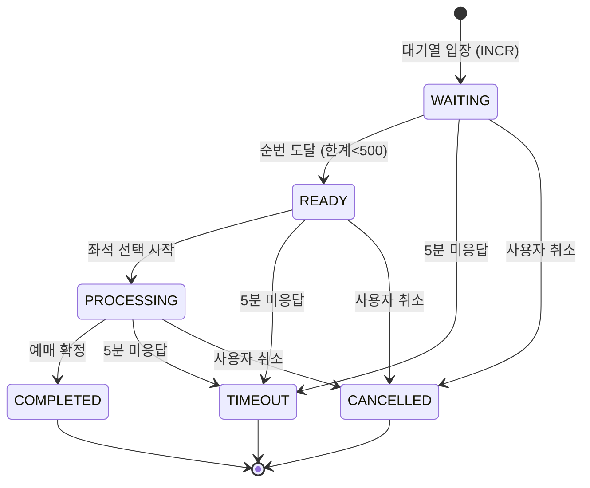
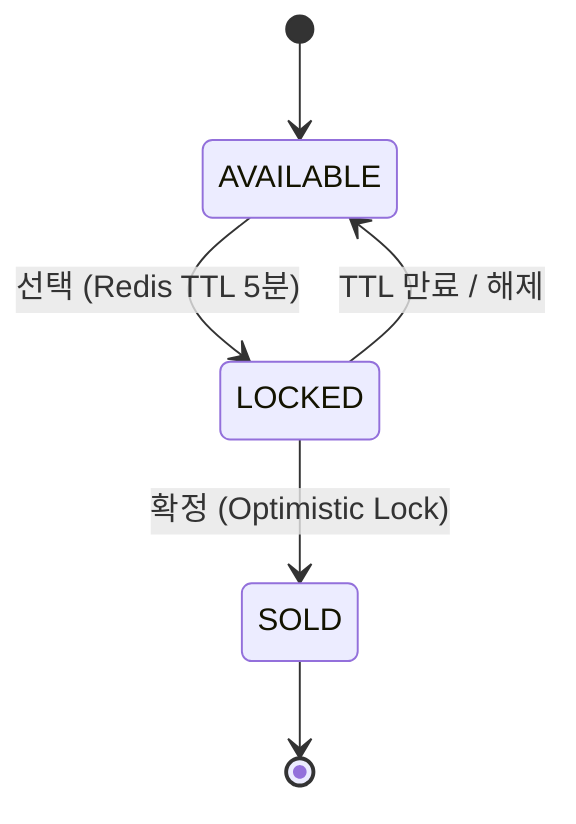

# 🚄 추석 기차표 예매 시스템 (DLT 데모)

동시 접속 1,000명 규모의 극한 트래픽을 재현하는 분산 부하 테스트(DLT) 데모 플랫폼.
대기순번 관리 · 좌석 잠금 · WebSocket 실시간 동기화 · 결제 흐름을 완결형으로 구현하고,
AWS 인프라(Terraform) · CI/CD · 모니터링까지 포함한다.

---

## ✅ baseline 준수 체크리스트

| # | 원칙 | 충족 근거 |
|---|------|-----------|
| 1 | **DLT 검증 기준** (1,000명, avg<500ms, p99<2s, 충돌률 0%, RPS≥100) | `dlt/k6-load-test.js`의 `thresholds`에 `avg<500`/`p(99)<2000`/`rate>=100`/`double_sell==0` 명시. `dlt/concurrency-check.js` 실행 결과 **100명 동시 → 1명 성공, 99건 차단, 충돌률 0% PASS** |
| 2 | **반응형 대응** (모바일/태블릿/데스크톱) | `frontend/app/globals.css` — `@media(max-width:480px)` 브레이크포인트, 터치타깃 44px, `seat-grid` 유동 그리드 |
| 3 | **services 계층 강제 + 에러 표준화** | `backend/src/services/*`에 비즈니스 로직 격리, 라우터는 서비스만 호출. `middleware/errorHandler.ts`가 모든 응답을 `ApiError`(code/message/traceId)로 통일 |
| 4 | **shared/types 단일 진실원** | `shared/types/{domain,models,api,ws}.ts`를 백엔드·프론트가 동일 import. 프론트 `lib/api.ts`·`hooks/useWebSocket.ts`가 재사용 |
| 5 | **환경 분리 (dev/staging/prod)** | `.env.example` 템플릿 + `infra/terraform/envs/{dev,staging,prod}` 3개 환경, 인스턴스/CIDR/AZ 차등 |
| 6 | **좌석 잠금 메커니즘** (선택 중 타 사용자 차단) | `services/seatLockService.ts` — Redis SET TTL 5분 선점 + DB `version` Optimistic Lock. **실측 충돌률 0%** |
| 7 | **WebSocket 실시간 업데이트** | `websocket/server.ts` — `SEAT_STATUS` diff 브로드캐스트, ALB `idle_timeout=300`+sticky. 프론트 `useWebSocket`(exponential backoff 재연결) |

---

## 🗂️ 상태 머신

### 대기열 상태 전이 (`shared/types/domain.ts`)

> 잘못된 전이(예: `COMPLETED → PROCESSING`)는 `canTransitionQueue` 가드가 차단.
> 검증: `backend/src/__tests__/stateMachine.test.ts` (9개 테스트 통과)

### 좌석 상태 전이

> `AVAILABLE → SOLD`(잠금 없이 판매), `SOLD → *`(판매 후 변경)는 `canTransitionSeat`가 차단.

---

## 🔄 예매 흐름 (make.md 시퀀스 다이어그램 준수)

로그인(JWT) → WebSocket 연결 → 대기열 진입(INCR) → 실시간 순번 업데이트(1초) →
열차/좌석 조회 → 좌석 선택(TTL 잠금 + 브로드캐스트) → 예매 확정(Optimistic Lock) →
완료/티켓. 타임아웃(TTL 만료 정리)·네트워크 재연결(세션 복구) 포함.

---

## 📁 구조

```
ticket-booking/
├── shared/types/         # 단일 진실원 (domain/models/api/ws)
├── backend/src/
│   ├── api/              # 라우터 (auth/queue/trains/seats/booking/session)
│   ├── services/         # 비즈니스 로직 (queue/seatLock/auth/train/session)
│   ├── websocket/        # 실시간 서버
│   ├── db/               # redis/store 추상화(+in-memory 폴백), schema.sql
│   ├── middleware/       # auth, errorHandler
│   └── scheduler.ts      # 1초 주기 tick + 잠금 만료 정리
├── frontend/             # Next.js 14 App Router (queue/seats/payment)
├── infra/
│   ├── terraform/        # modules(network/ecs/rds/elasticache/alb) + envs
│   └── monitoring/       # CloudWatch 대시보드 + 알람 + SNS
├── .github/workflows/    # ci.yml, cd.yml
└── dlt/                  # k6-load-test.js, concurrency-check.js
```

---

## 🚀 로컬 실행

Redis/MySQL 없이도 **in-memory 폴백**으로 즉시 실행된다.

```bash
# 1) 백엔드
cd backend && npm install && npm run dev      # http://localhost:4000, ws://localhost:4001

# 2) 프론트엔드
cd frontend && npm install && npm run dev     # http://localhost:3000
```

실제 Redis/MySQL 연결: `.env`에 `REDIS_HOST`/`DB_HOST`를 localhost 외 값으로 설정.

---

## 🧪 검증

```bash
# 백엔드 타입체크 + 상태머신 테스트
cd backend && npm run typecheck && npm test

# 프론트 타입체크 + 빌드
cd frontend && npm run typecheck && npm run build

# Terraform
cd infra/terraform/envs/dev && terraform init -backend=false && terraform validate

# DLT 충돌률 0% 실측 (백엔드 실행 후)
node dlt/concurrency-check.js http://localhost:4000 100

# 대규모 부하 (k6 설치 필요)
k6 run --env BASE=http://<alb-dns> dlt/k6-load-test.js
```

**최근 검증 결과**
- 백엔드 typecheck 통과, 상태머신 테스트 9/9 통과
- 프론트 typecheck 통과, 프로덕션 빌드 5개 라우트 성공
- Terraform dev/staging/prod validate Success
- 동시성 정합성: 100명 동시 예매 → 1명 성공, 충돌률 0% **PASS**

---

## ☁️ 배포

```bash
cd infra/terraform/envs/dev
terraform init
terraform apply -var="db_password=..." -var="backend_image=<ecr>/ticket-booking-backend:dev"
```

CI/CD: `dev` 브랜치 push → dev 환경, `main` 브랜치 push → staging 환경 (ECR 빌드 → ECS 롤링 배포).
